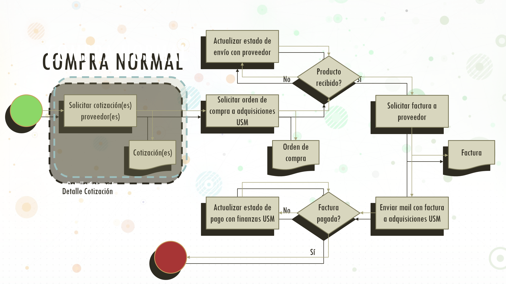
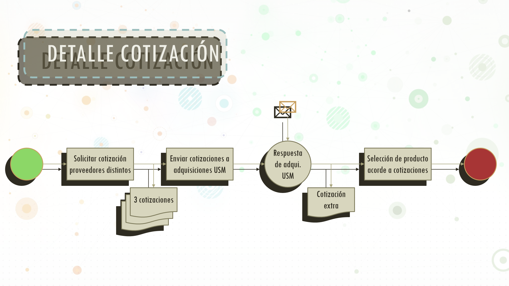

# Finanzas - Compras
 La persona que esté a cargo de la administración de finanzas del FabLab UTFSM deberá realizar, entre otras funciones, los procesos de adquisición de materias primas, materiales, herramientas y maquinaria. La orgánica universitaria establece un protocolo para cada una de estas adquisiciones, lo cual se detallará en el presente documento.
 
 ## Compra Normal
 Se entiende por compra normal la acción de solicitar la adquisición de materiales, herramientas ligeras y materia prima para desarrollar algún taller, proyecto o simplemente para el funcionamiento normal del laboratorio.
 
 1.- Solicitar cotización de los productos requeridos a los proveedores respectivos, indicando  razón social, rut, mail de contacto y dirección de la universidad.
 
 2.1.- Si es primera vez que se está comprando el item dentro del proyecto o taller, se deben adjuntar 3 cotizaciones distintas como solicitud a adquisiciones USM, la cual responderá con una cuarta cotización gestionada por dicha unidad. Con todas estas cotizaciones se procede a escojer la que mejor se ajuste a las necesidades.
 
 2.2.- Por el contrario, si se está comprando al mismo proveedor que se ha comprado anteriormente, puede ser justificación suficiente para utilizar solamente 1 cotización en vez del proceso anterior.
 
 3.- Solicitar a adquisiciones USM la emisión de una Orden de Compra a 30 días (OC30), documento que sirve como comprobante para comenzar la compra con el proveedor seleccionado. Es importante destacar que el proveedor debe estar de acuerdo explícitamente con este método de pago.
 
 4.- Una vez comprado el producto y gestionado el envío, se debe a la recepción del pedido para solicitar la factura al proveedor (en el caso que no venga adjunta en el paquete recepcionado). En caso de no recibir el pedido dentro del plazo acordado hay que actualizar el estado de envío con el proveedor e intentar llegar a un acuerdo o una aclaración sobre el estado del mismo.
 
 5.1.- Teniendo la factura física o digital, se debe enviar por mail la cotización, OC y factura juntas a adquisiciones USM para gestionar el pago. Este sería un mail de ejemplo para estos fines [INSTERTAR MAIL TIPO]. En caso que la factura tarde más de 30 días en ser pagada, contactar a adquisiciones USM para gestionar el pronto pago de la misma. 
 
 5.2.- Existe la opción de gestionar un pronto pago a un proveedor, lo cual debe ser solicitado explícitamente a la jefatura de finanzas con copia a adquisiciones.
 
 
 ## Imágenes

